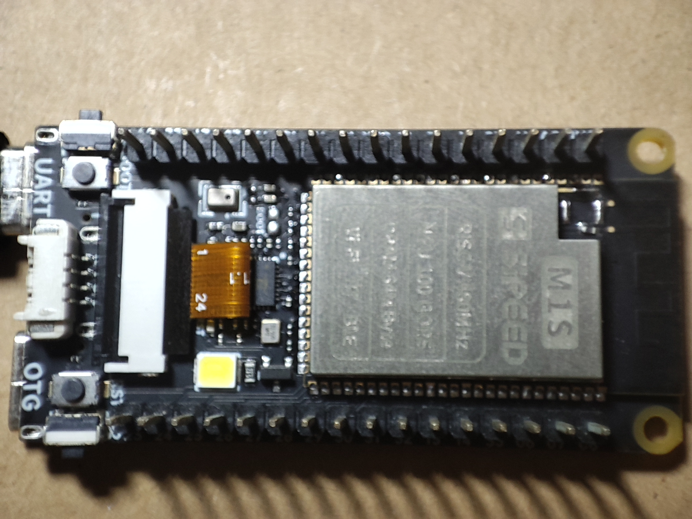
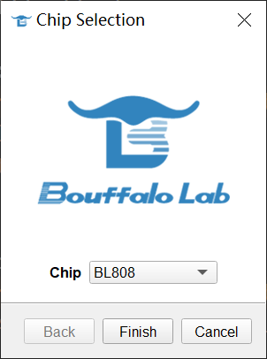
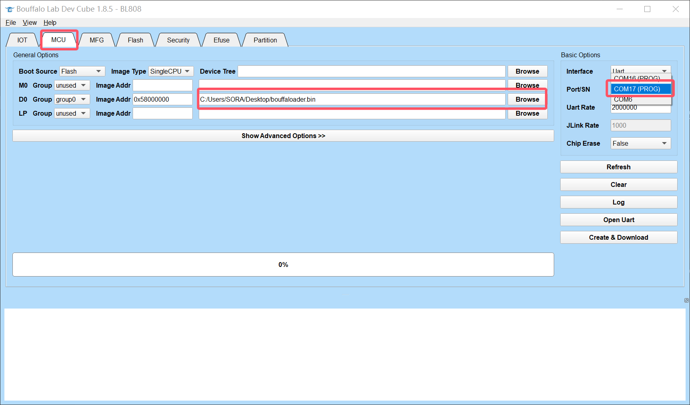
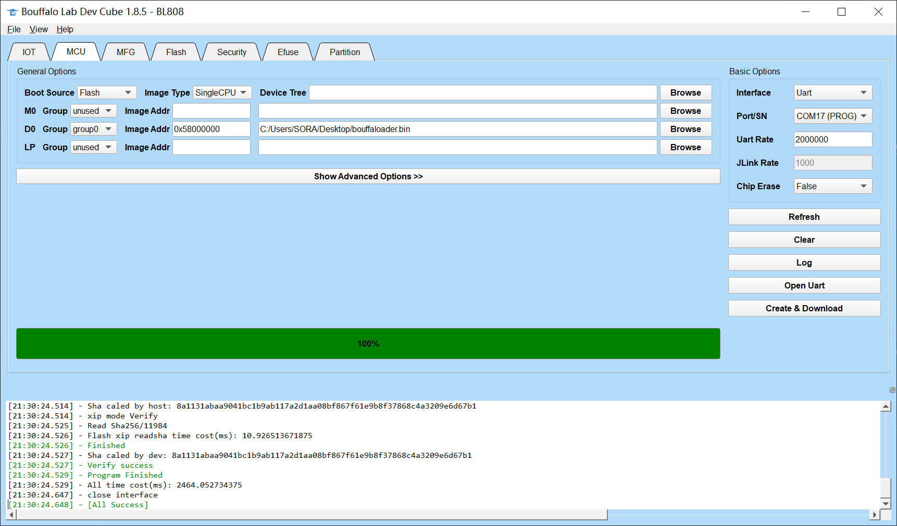
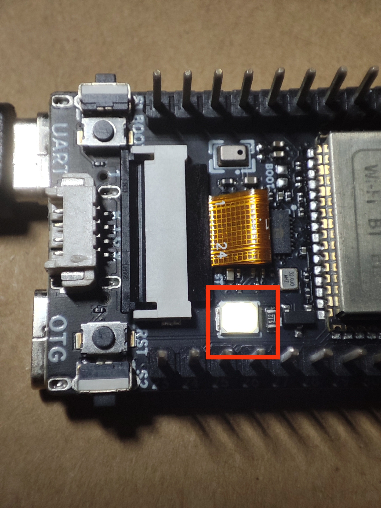

Bouffaloader demo

Build this example with:

```sh
rustup target install riscv64imac-unknown-none-elf
cargo build --target riscv64imac-unknown-none-elf --release
```

And we can find the elf file `target/riscv64imac-unknown-none-elf/release/bouffaloader`.
To flash this elf file to the board using [Bouffalo Lab Dev Cube](https://dev.bouffalolab.com/download), we need to convert it to a binary file first.

Download essential pakages:
```sh
cargo install cargo-binutils
rustup component add llvm-tools-preview
```

Convert the elf file to a binary file:
```sh
rust-objcopy target/riscv64imac-unknown-none-elf/release/bouffaloader --strip-all -O binary ./bouffaloader.bin
```

Then we can flash the binary file to the board using Bouffalo Lab Dev Cube.
1. Connect the board to the computer (use M1s Dock as example):
Normally, you'll see 2 new serial ports.
If not, check the [Sipeed wiki](https://wiki.sipeed.com/hardware/en/maix/m1s/other/start.html#Questions) for help.



2. Open Bouffalo Lab Dev Cube, choose BL808 as the target, and click "Finish":


3. Select the MCU option, the correct serial port (the bigger one) and the binary file, then click "Create & Download":


4. Wait for the flashing process to complete, and you'll see the "All Success" message:


5. After the flashing is complete, you can open the serial port (the bigger one, baudrate 2000000bps) and see the output of the program and use the console to operate the led on board:

```sh
Welcome to console example by bouffalo-hal🦀!
Command helps: 
    led [<none>|on|off|switch]: operate on LED
> led on
> led
LED state: Low
> led off
> led
LED state: High
> led switch
> led
LED state: Low
> test
Unknown command: test
> 
```
You can also see the led on the board changing:


